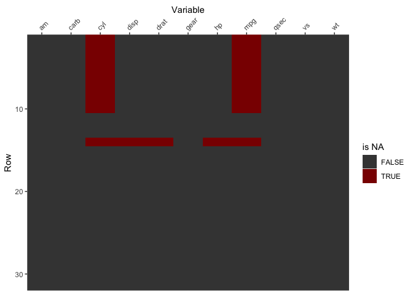

NAwhere
================

# NAwhere function

The NAwhere function shows you where NA values are in your dataset. It
takes a data.frame or a matrix of dimensions nxp as input and returns a
plot of size nxp, where each non-missing value is shown as a grey
rectangle, and each missing value is shown as a dark red rectangle.

It is useful to visualize easily which variables contain NAs, and
wheteher these NA values are present in streaks, possibly indicating an
issue that needs to be further investigated.

# Example

``` r
mtcarsNA = mtcars
mtcarsNA[1:10,1:2] = NA
mtcarsNA[14,1:5] = NA
NAwhere(mtcarsNA)
```

<!-- -->
